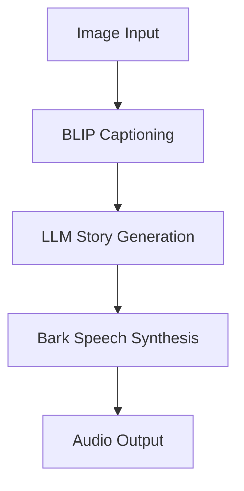

# Visual Symphony - Multimodal Narrative Generator

### Demo
https://github.com/user-attachments/assets/0d0aa59e-4b55-4d80-9f33-4ef76fee6b63

## Project Overview
AI-powered pipeline transforming visual inputs into immersive audio narratives through:

1. Image Captioning (BLIP)
2. Contextual Story Generation (Mixtral-8x7B via Groq)
3. Emotional Speech Synthesis (Bark)

## Features
- **Multimodal Processing Chain**
  - Image → Text → Story → Speech conversion
  - Context-aware narrative generation
- **Production Optimizations**
  - TensorFlow/Keras performance tuning
  - Cross-framework compatibility (PyTorch/TF)
  - Memory-efficient inference

## Installation
```bash
python -m venv .venv
source .venv/bin/activate
pip install -r requirements.txt
```

## Configuration
```bash
# .env template
GROQ_API_KEY=your_api_key_here
```

## Usage
```python
# Core workflow
image_description = image2text("input.jpg")
narrative = gen_story(image_description) 
gen_tts(narrative)
```

## Architecture


## License
Apache 2.0 - See included LICENSE file
